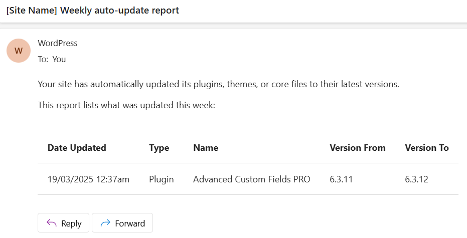

# WP Weekly Auto Updates Report Email

**Fed up WordPress's Auto Updates bombarding you or a client with emails, with only 1 updated item per email?**

Just drop this php file into your theme, require it in your theme's `functions.php`:

```php
include get_stylesheet_directory() . "/weekly_auto_updates_report_email.php";
```

Then you will no longer have emails bombarding you with each update. Instead the updates will get stored in a temporary file in your theme as `/logs/auto_updated_items.json`, and a WP cron job is setup to run once a week to generate a weekly updates report email from the data saved in the file. The file will then be automatically deleted.

The class disables auto update emails for `core`, `plugin`, and `theme`, because it will handle all three in the weekly report.

>[!NOTE]
> This repo is primarily for custom coded themes so auto `theme` updates is disabled by default. But it can be re-enabled, and will still work.

#### Email defaults that can be changed:

- The default email subject will be `[Site Name] Weekly auto-update report`.

- The email will be sent to the Admin Email as defined in the Dashboard General Settings.

	You can also add extra email addresses to send to, using the `$extra_email_addresses` property of the class.

	As well as specifying email addresses, you can also specify a user within the WordPress site to send the email to. Just specify the username, as long as the username doesn't have an `@` symbol in the name (the code recognises usernames by checking it doesn't have `@` in).

	

- The default email will look like this (but can be changed):


