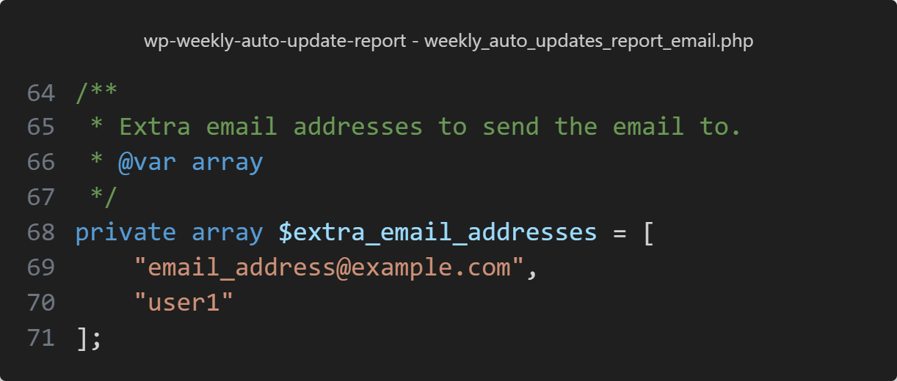

# WP Weekly Auto Updates Report Email

**Fed up WordPress's Auto Updates bombarding you or a client with emails, with only 1 updated item per email?**

Just drop this php file into your theme, require it in your theme's `functions.php`:

```php
include get_stylesheet_directory() . "/weekly_auto_updates_report_email.php";
```

Then you will no longer have emails bombarding you with each update. Instead the updates will get stored in a temporary file in your theme as `/logs/auto_updated_items.json`, and a WP cron job is setup to run once a week to generate a weekly updates report email from the data saved in the file.

---

- The default email subject will be `[Site Name] Weekly auto-update report`.

- By default auto theme updates is disabled.

>[!NOTE]
> This repo is mainly for custom coded themes so auto theme updates is disabled, but can be re-enabled.

- The email address it will be sent to is the Admin Email as defined in the Dashboard General Settings.

- The default email will look like this (but can be changed):


